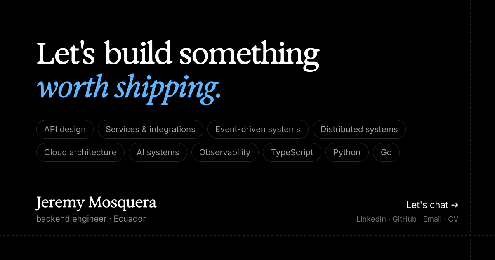

# Portfolio

Personal site for [Jeremy Mosquera](https://jeremyportfolio.vercel.app) — backend engineer focused on APIs, cloud, and developer tooling.



**Live:** [jeremyportfolio.vercel.app](https://jeremyportfolio.vercel.app)

## Run locally

```bash
bun install
bun run dev
```

Open [http://localhost:3000](http://localhost:3000).

```bash
bun run build   # production build
bun run start   # serve production build
bun run lint    # ESLint
```

## Routes

| Path | Page |
| --- | --- |
| `/` | Home (hero, experience, projects, writing) |
| `/about` | About |
| `/projects` | Project grid |
| `/projects/[slug]` | Case study |
| `/writing` | Posts |
| `/writing/[slug]` | Post |
| `/llms.txt` | Agent brief for recruiters' tools |

## Stack

- **Next.js 16** (App Router) + **React 19**
- **TypeScript**
- **Tailwind CSS v4**
- **Bun** for install and scripts
